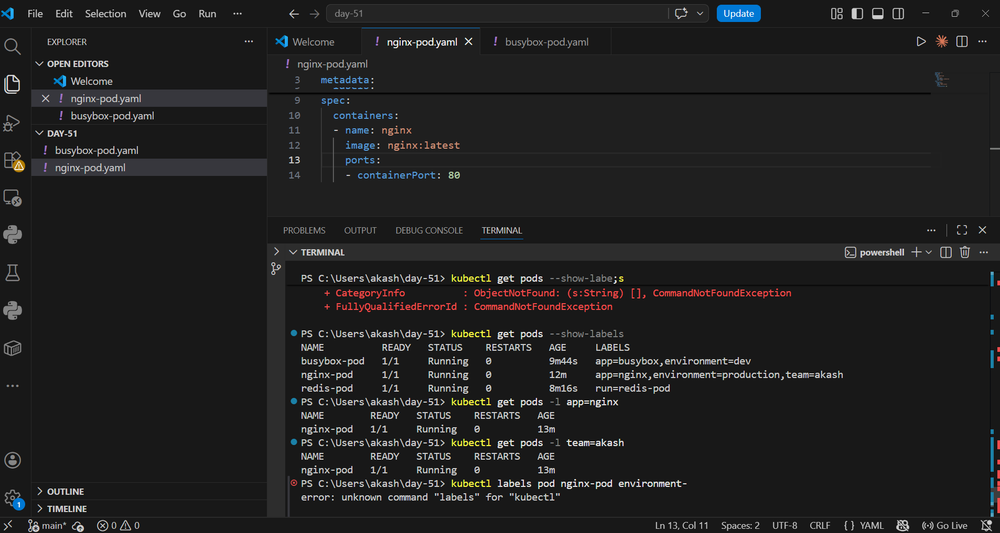
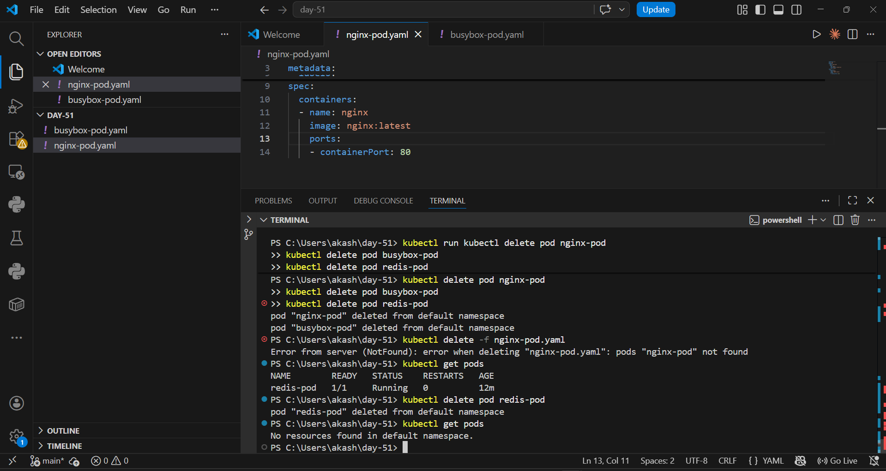

# Day 51 – Kubernetes Manifests and Your First Pods

## The Four Required Fields of a Kubernetes Manifest

Every Kubernetes resource is defined using a YAML manifest with four required top-level fields:

| Field | Purpose |
|-------|---------|
| `apiVersion` | Tells Kubernetes which API version to use. For Pods it is `v1`. Other resources use different versions like `apps/v1`. |
| `kind` | The type of resource you want to create — e.g. `Pod`, `Deployment`, `Service`. |
| `metadata` | The identity of the resource. `name` is required. `labels` are key-value pairs used for organization and selection. |
| `spec` | The desired state. For a Pod this means which containers to run, which images, which ports, environment variables, etc. |

---

## Pod Manifests

### 1. nginx-pod.yaml

```yaml
apiVersion: v1
kind: Pod
metadata:
  name: nginx-pod
  labels:
    app: nginx
    environment: production
    team: akash
spec:
  containers:
  - name: nginx
    image: nginx:latest
    ports:
    - containerPort: 80
```

### 2. busybox-pod.yaml

```yaml
apiVersion: v1
kind: Pod
metadata:
  name: busybox-pod
  labels:
    app: busybox
    environment: dev
spec:
  containers:
  - name: busybox
    image: busybox:latest
    command: ["sh", "-c", "echo Hello from BusyBox && sleep 3600"]
```

> **Why the `command` field?** BusyBox does not run a long-lived server. Without a command that keeps it running, the container exits immediately and the pod goes into `CrashLoopBackOff`.

### 3. redis-pod (created imperatively)

```bash
kubectl run redis-pod --image=redis:latest
```

This pod was created using the imperative approach — no YAML file needed.

---

## Imperative vs Declarative

| Approach | How | Example |
|----------|-----|---------|
| **Imperative** | Tell Kubernetes to do something directly via a command | `kubectl run redis-pod --image=redis:latest` |
| **Declarative** | Write a YAML file describing desired state, then apply it | `kubectl apply -f nginx-pod.yaml` |

**Which is better for production?**

**Declarative** is preferred in production because:
- YAML files can be stored in Git (version history, code reviews, rollback)
- `kubectl apply` is idempotent — safe to run multiple times
- Your whole team can see exactly what is deployed by reading the files

Imperative commands are useful for **quick testing and debugging** but leave no record of what was created.

**Pro tip — scaffold a manifest without creating anything:**
```bash
kubectl run test-pod --image=nginx --dry-run=client -o yaml
```

---

## Pods Running – Screenshot

### kubectl get pods --show-labels



All three pods running with their labels:
- `busybox-pod` → `app=busybox, environment=dev`
- `nginx-pod` → `app=nginx, environment=production, team=akash`
- `redis-pod` → `run=redis-pod`

### kubectl get pods (after cleanup)



After deleting all pods: `No resources found in default namespace.`

---

## Label Filtering

Labels are key-value pairs attached to resources. They have no built-in meaning to Kubernetes — they exist for humans and selectors to organize and filter resources.

```bash
# Show all pods with their labels
kubectl get pods --show-labels

# Filter by label
kubectl get pods -l app=nginx
kubectl get pods -l team=akash
kubectl get pods -l environment=dev

# Add a label to an existing pod
kubectl label pod nginx-pod environment=production

# Remove a label
kubectl label pod nginx-pod environment-
```

---

## Validate Before Applying

```bash
# Client-side validation (no cluster needed)
kubectl apply -f nginx-pod.yaml --dry-run=client

# Server-side validation (checks against cluster API)
kubectl apply -f nginx-pod.yaml --dry-run=server
```

If you remove the `image` field and run dry-run, Kubernetes returns an error like:
```
error: pod "nginx-pod" is invalid: spec.containers[0].image: Required value
```

---

## What Happens When You Delete a Standalone Pod?

When you delete a standalone Pod with `kubectl delete pod nginx-pod`, **it is gone forever.**

There is no controller watching it. Kubernetes does not recreate it. If the node goes down or the pod crashes, nothing brings it back.

This is why in production you use **Deployments** instead of bare Pods. A Deployment controller constantly watches and ensures the desired number of replicas are always running — if a pod dies, it gets recreated automatically.

---

## Key Commands Learned Today

```bash
kubectl apply -f <file>.yaml          # Create or update a resource
kubectl get pods                       # List all pods
kubectl get pods -o wide               # Show node and IP
kubectl get pods --show-labels         # Show labels
kubectl get pods -l <key>=<value>      # Filter by label
kubectl describe pod <name>            # Detailed info + events
kubectl logs <name>                    # Container stdout/stderr
kubectl exec -it <name> -- /bin/sh    # Shell into the container
kubectl delete pod <name>              # Delete a pod
kubectl delete -f <file>.yaml          # Delete using manifest
kubectl run <name> --image=<image>     # Imperative pod creation
kubectl get pod <name> -o yaml         # Export pod as YAML
```

---

*Day 51 of #90DaysOfDevOps | #DevOpsKaJosh | #TrainWithShubham*
